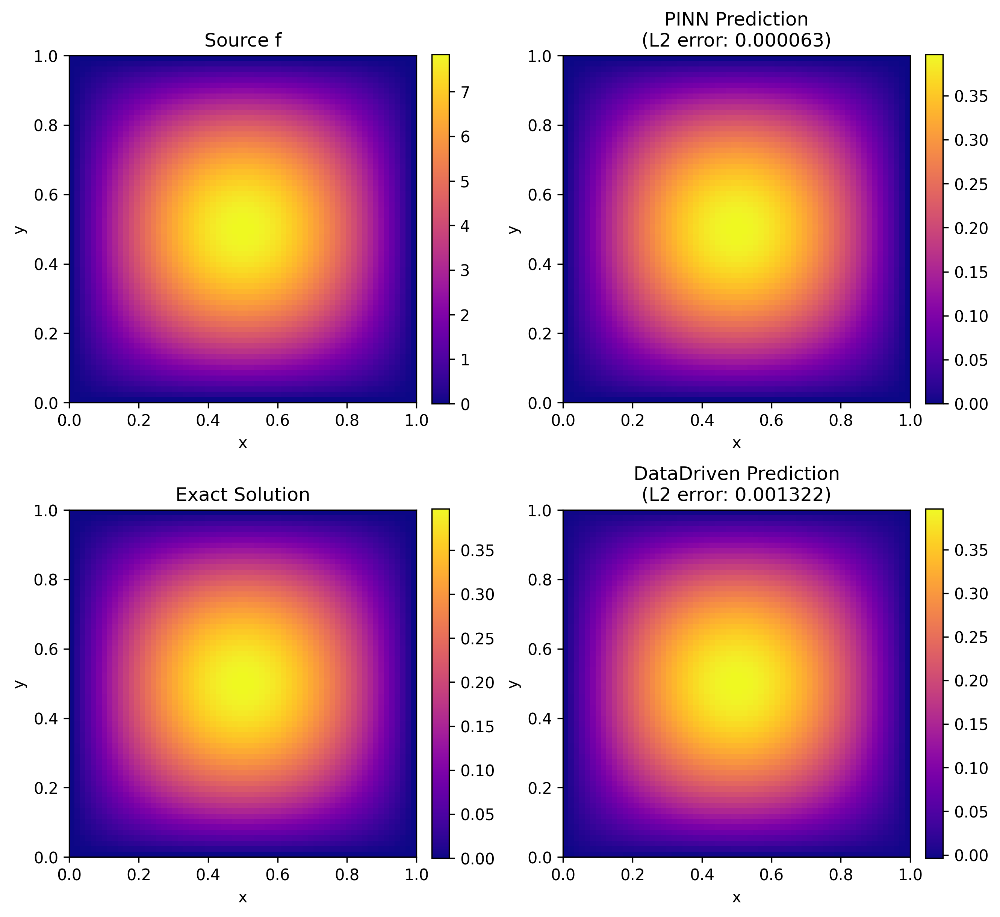
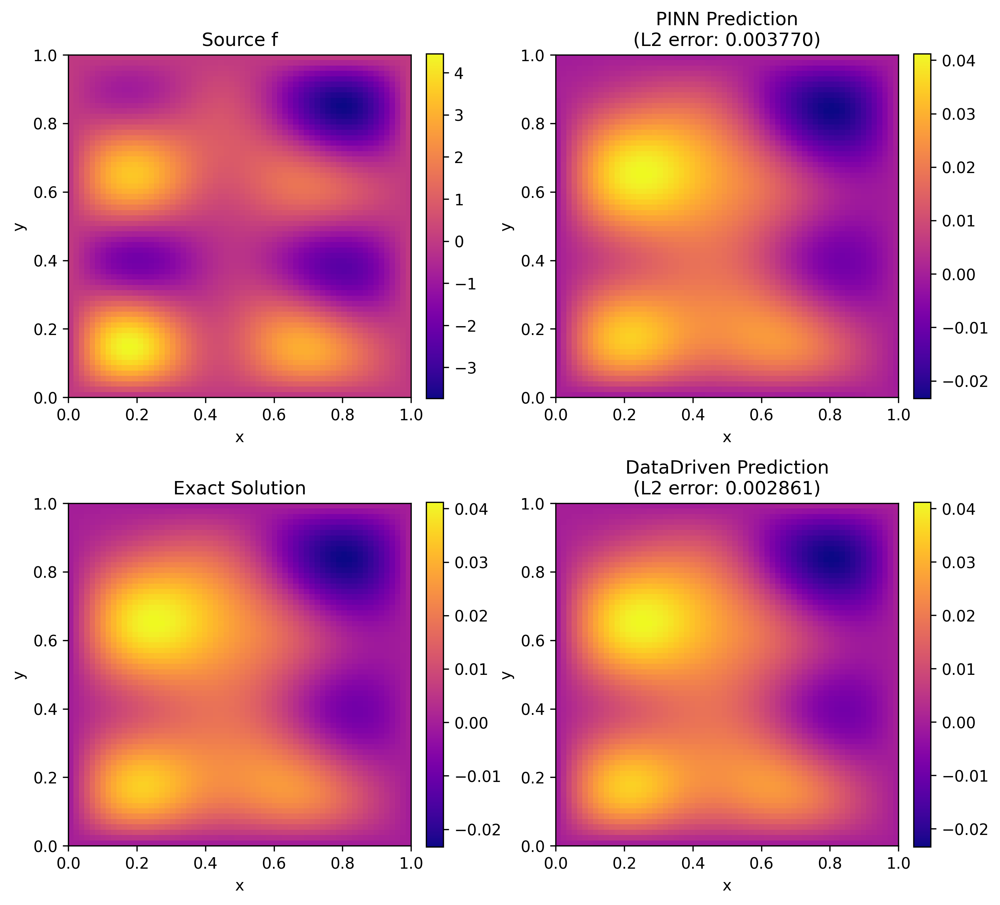
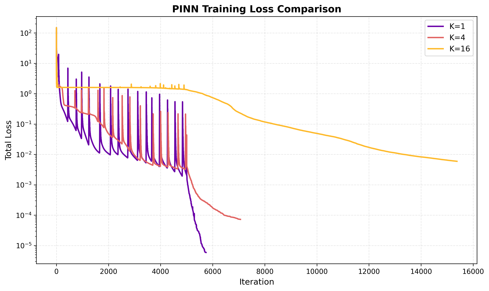
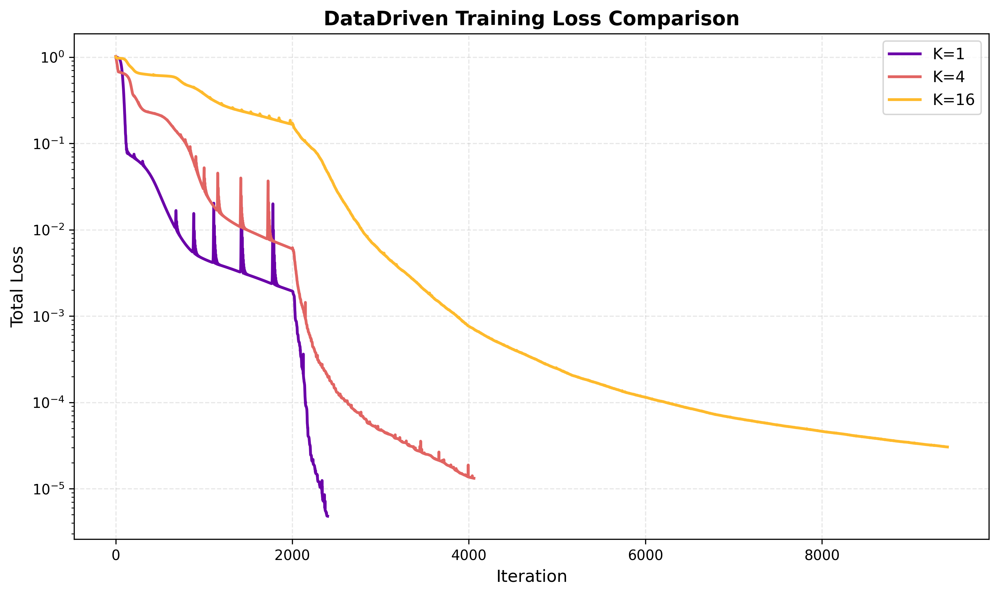

# Task 1 — Loss Landscapes: PINNs vs. Data-Driven Solvers

## Overview

This task investigates spectral bias in Physics-Informed Neural Networks (PINNs) versus supervised data-driven solvers on the 2D Poisson equation. Both methods share an identical MLP architecture; the only difference is the loss function. By varying the frequency content of the source term (controlled by parameter K), the experiment reveals how increasing spatial frequency makes the PINN loss landscape increasingly non-convex and difficult to optimise, while the data-driven landscape remains smooth throughout.

---

## Problem

The Poisson equation on the unit square:

```
-Δu(x, y) = f(x, y),   (x, y) ∈ [0, 1]²
 u = 0  on ∂[0,1]²
```

The multi-scale source term and its analytical solution are constructed from Fourier basis functions:

```
f(x, y) = Σ_{i,j=1}^{K} a_{ij} · 2π²(i² + j²) · sin(πix) · sin(πjy)

u(x, y) = Σ_{i,j=1}^{K} a_{ij} · sin(πix) · sin(πjy)
```

where the coefficients `a_{ij} ~ N(0, (i² + j²)^{-r})` with `r = 0.5` are drawn randomly. Increasing K raises the maximum spatial frequency in both f and u, making it progressively harder for gradient-based optimisation to satisfy the PDE residual (the Laplacian operator scales as ∇² ~ k², amplifying high-frequency components quadratically in the PINN loss).

---

## Files

| File                 | Purpose                                                      |
|----------------------|--------------------------------------------------------------|
| `config_task1.py`    | All hyperparameters and output paths                         |
| `physics.py`         | Analytical source term and solution (NumPy + PyTorch)        |
| `models.py`          | MLP, BaseSolver, PoissonPINN, DataDrivenSolver               |
| `utils_task1.py`     | Plotting and evaluation helpers; HDF5 landscape cache        |
| `task1_1_data.py`    | Sub-task 1.1: data generation and visualisation              |
| `task1_2_train.py`   | Sub-task 1.2: training PINN and Data-Driven models           |
| `task1_3_landscape.py` | Sub-task 1.3 (bonus): loss landscape visualisation         |

---

## How to Run

All commands are run from the **project root**.

**Step 1 — Generate data**
```bash
python task1/task1_1_data.py
```
Generates source/solution sample plots for K = 1, 4, 8, 16.
Output: `plots/task1_1/`

**Step 2 — Train models**
```bash
python task1/task1_2_train.py
```
Trains PINN and Data-Driven solvers for K = 1, 4, 16. Checkpoints saved to `models/`.
Output: `models/PINN_K*.pt`, `models/DataDriven_K*.pt`, `plots/task1_2/`

> To retrain from scratch: set `USE_PRETRAINED = False` in `task1/config_task1.py`.

**Step 3 — Loss landscapes (bonus)**
```bash
python task1/task1_3_landscape.py
```
Computes 2D loss landscapes around the converged parameters using filter-normalised random directions.
Output: `plots/task1_3/` (HDF5 cache in `plots/task1_3/cache/`)

> Cache behaviour is controlled by the `CACHE_MODE` setting in `task1/config_task1.py` (`'use'`, `'recompute'`, or `'disabled'`).

---

## Approach

### Network architecture
Both solvers share the same MLP: 4 hidden layers with 256 neurons each, Tanh activations, input `(x, y) ∈ [0,1]²`, scalar output `û(x, y)`.

### PINN loss
```
L_PINN = (1/N_c) Σ (-Δû(xᵢ) - f(xᵢ))²  +  λ_BC · (1/N_b) Σ û(x_b)²
```
Evaluated at N_c = 20,000 Sobol quasi-random collocation points with boundary penalty λ_BC = 400.

### Data-Driven loss
```
L_DD = (1/N_g) Σ (û(xᵢ) - u(xᵢ))²
```
MSE against the exact analytical solution on a 64×64 uniform grid (N_g = 4,096 points).

### Two-stage optimiser
1. **Adam:** PINN — 5,000 iterations, lr = 1e-3; Data-Driven — 2,000 iterations, lr = 1e-4.
2. **L-BFGS:** up to 10,000 iterations for fine-tuning (both solvers).

### Loss landscape method
Filter-normalised random directions (Li et al., 2018). Two random perturbation vectors δ, η are drawn and filter-normalised to match the scale of the trained weights. The loss is evaluated on a 64×64 grid of parameters `θ* + α·δ + β·η` with α, β ∈ [−1, 1].

---

## Implementation Notes

- `BaseSolver` is an abstract class that provides the shared training loop, L-BFGS fine-tuning, error evaluation, and checkpoint logic. `PoissonPINN` and `DataDrivenSolver` each override only `prepare_training_data()` and `compute_loss()`.
- Output normalisation (zero mean, unit variance over the training grid) is applied in `DataDrivenSolver` to compensate for the small magnitude of the solution (~0.01 for typical realisations). PINN training is physics-constrained and does not require this normalisation.
- The Laplacian for the PINN residual is computed via `torch.autograd.grad` with `create_graph=True`, enabling second-order automatic differentiation.
- Sobol quasi-random sequences (via `torch.quasirandom.SobolEngine`) are used for collocation point generation to ensure uniform coverage of the domain.

---

## Results

### L² relative errors

| K  | PINN error | Data-Driven error |
|----|------------|-------------------|
| 1  | 0.0063%    | 0.1322%           |
| 4  | 0.3770%    | 0.2861%           |
| 16 | 23.3354%   | 0.4873%           |

### Training iterations (Adam + L-BFGS combined)

| K  | PINN   | Data-Driven |
|----|--------|-------------|
| 1  | 5,745  | 2,401       |
| 4  | 7,067  | 4,059       |
| 16 | 15,379 | 9,424       |

### Loss landscape geometry

| K  | PINN peak loss | DD peak loss | Character                                      |
|----|---------------|-------------|------------------------------------------------|
| 1  | ~108          | ~10         | Both landscapes smooth                         |
| 4  | ~800          | ~30         | PINN develops sharper valleys                  |
| 16 | >5,000        | ~216        | PINN nearly unnavigable; DD remains smooth     |

**Key finding:** both methods use the same network architecture, confirming the network has sufficient representational capacity (proven by the data-driven case, which fits K=16 to 0.49%). PINN fails at K=16 not because the network cannot represent the solution, but because the PDE residual loss scales with k², making the loss landscape at high frequencies extremely sharp and non-convex.

---

## Plots

### Predictions: PINN vs. Data-Driven






### Training curves





### Loss landscapes (3D surface)


