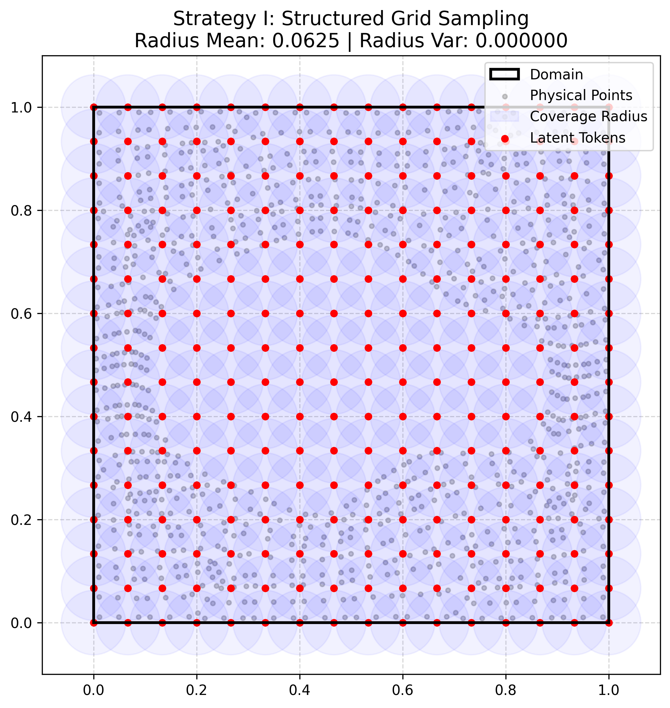
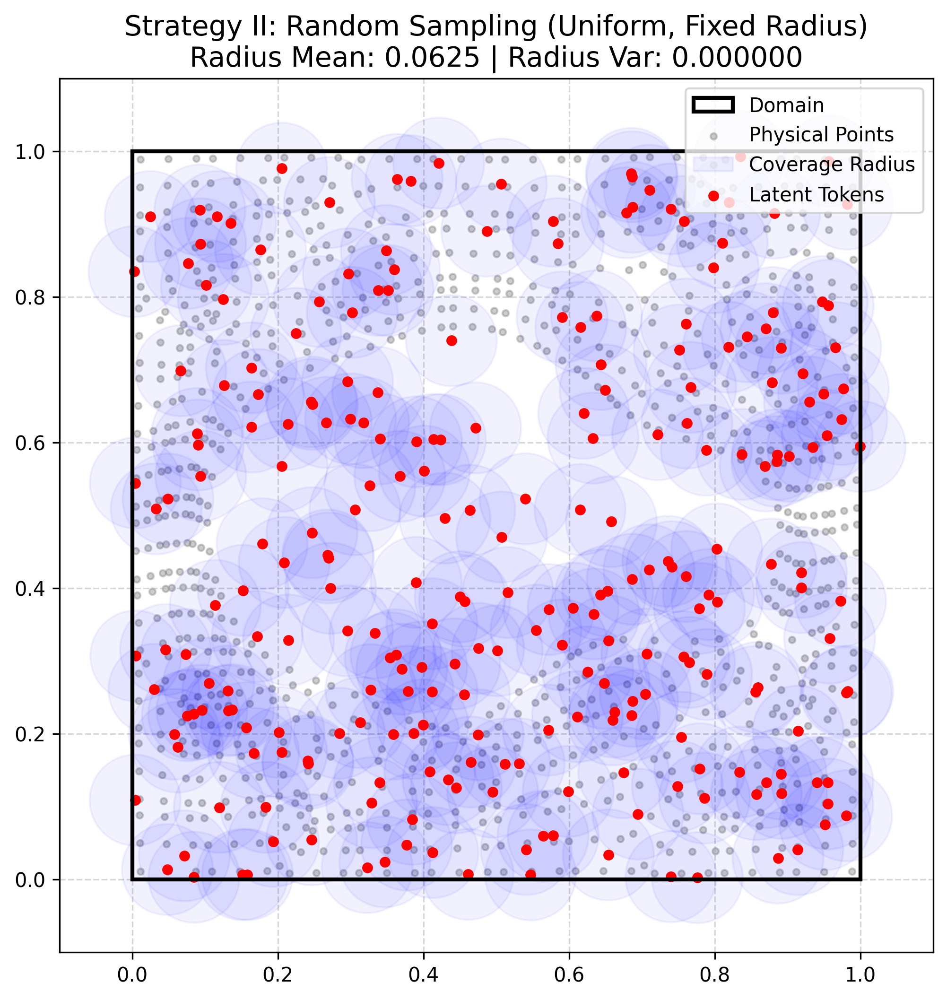
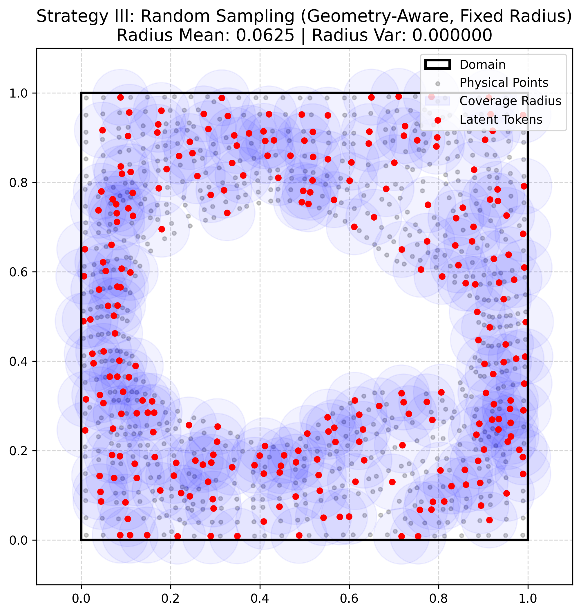
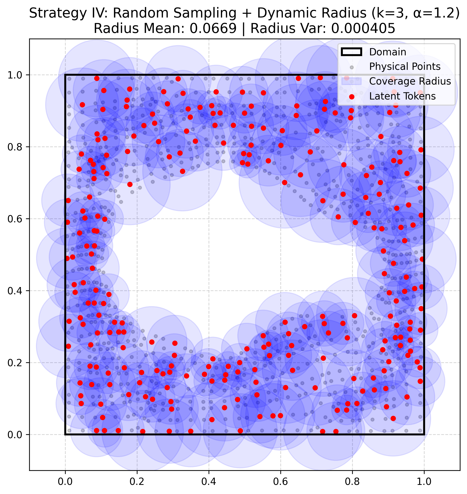

# Task 3 — GAOT Extension for Irregular Geometries

## Overview

The standard Geometry-Aware Operator Transformer (GAOT) tokenizes the input domain onto a regular 64×64 stencil grid (4,096 tokens). This task extends GAOT to random-sampling tokenization (Strategy II) combined with a dynamic radius strategy, enabling deployment on irregular geometries without the over-tokenisation inherent in a fixed dense grid. The implementation is benchmarked against the baseline on the 2D linear Elasticity dataset.

---

## Sub-implementations

| Directory                                | Description                                                  |
|------------------------------------------|--------------------------------------------------------------|
| `GAOT-base/`                             | Baseline GAOT with 64×64 stencil-grid tokenization           |
| `GAOT-random-sampling-dynamic-radius/`   | Extended GAOT with random sampling and dynamic radius        |

Each sub-directory contains its own `README.md` with installation, configuration, and run instructions. Start there to actually run the code.

---

## Problem

The **Elasticity dataset** consists of 2D linear elasticity problems on irregular mesh geometries with 972 physical mesh points. The task is to predict the displacement field from boundary conditions. GAOT requires a tokenization step that maps the irregular mesh onto a structured representation for the Transformer.

The standard 64×64 stencil grid generates 4,096 tokens for 972 physical points — a **4.2× oversampling** that inflates memory and compute without improving coverage. A tokenization strategy that places far fewer tokens while still covering all 972 physical points is desirable.

---

## Design: Dynamic Radius

With a fixed small radius (e.g., r = 0.033 used by the baseline), randomly placed tokens leave coverage gaps in sparse regions of the domain. The solution is to adapt the radius to the local token density using the formula from RIGNO:

```
r_l = α · d_k(y_l)
```

where `d_k(y_l)` is the distance from token `y_l` to its k-th nearest token neighbour, `k = 3`, and `α = 1.2`. Tokens in sparse regions receive larger radii; tokens in dense regions receive smaller radii.

Computed radius statistics for 256 random tokens:

| Statistic | Value |
|-----------|-------|
| Minimum   | 0.065 |
| Maximum   | 0.254 |
| Mean      | 0.134 |

All 972 physical mesh points are covered by at least one token (100% coverage verified).

---

## Tokenization Strategies

Four tokenization strategies are visualised and compared:

**Strategy 1 — Baseline 64×64 stencil grid (4,096 tokens)**



**Strategy 2 — Random uniform sampling (256 tokens)**



**Strategy 3 — Random geometric sampling (256 tokens)**



**Strategy 4 — Random sampling with dynamic radius (256 tokens)**



---

## Implementation Changes

Three files in `GAOT-random-sampling-dynamic-radius/src/` differ from the baseline `GAOT-base/src/`:

| File                 | Change                                                                            |
|----------------------|-----------------------------------------------------------------------------------|
| `data_processor.py`  | Generates random token positions via `torch.randperm` (seed = 42) instead of regular grid |
| `graph_builder.py`   | Computes per-token dynamic radius using `torch.cdist` and k-th nearest-neighbour distance |
| `neighbor_search.py` | Supports per-token variable radius (previously only a single global radius value) |

---

## Results

| Strategy                     | Tokens | Radius                     | Rel. L¹ Error | Training time |
|------------------------------|--------|----------------------------|---------------|---------------|
| Grid 64×64 (baseline)        | 4,096  | 0.033 (fixed)              | 5.29%         | ~8 hours      |
| Grid 16×16                   | 256    | 0.125 (fixed)              | 8.83%         | ~1 hour       |
| Random + Dynamic (k=3, α=1.2)| 256    | 0.065–0.254 (mean 0.134)   | 24.46%        | ~1 hour       |

Note: using 256 random tokens with the original small radius r = 0.033 produced 81.9% error, confirming that the radius must scale with token density.

---

## Discussion

The random-sampling variant achieves full coverage of the 972 physical mesh points but underperforms grid 16×16 by a large margin (24.46% vs. 8.83%), despite both using 256 tokens. The performance gap stems from token placement pattern rather than token count:

- GAOT's Transformer uses positional encodings designed for regular grids, where spatial proximity and sequence index alignment are consistent. Random tokenization breaks this correspondence even when coverage is maintained.
- RIGNO (which inspired the dynamic-radius formula) achieves competitive results with random sampling by using graph neural networks instead of Transformers. This suggests the architectural choice — not the tokenization strategy — is the key determinant of performance with irregular token placements.
- The Bonus sub-task (continuous coordinate positional encodings and cross-attention mechanisms) would address this limitation architecturally, decoupling positional encoding from the assumption of a regular token grid.

---

## How to Run

Full run instructions (dataset download, configuration, training, evaluation) are provided in each sub-directory:

- **Baseline:** follow [`GAOT-base/README.md`](GAOT-base/README.md)
- **Extended model:** follow [`GAOT-random-sampling-dynamic-radius/README.md`](GAOT-random-sampling-dynamic-radius/README.md)
